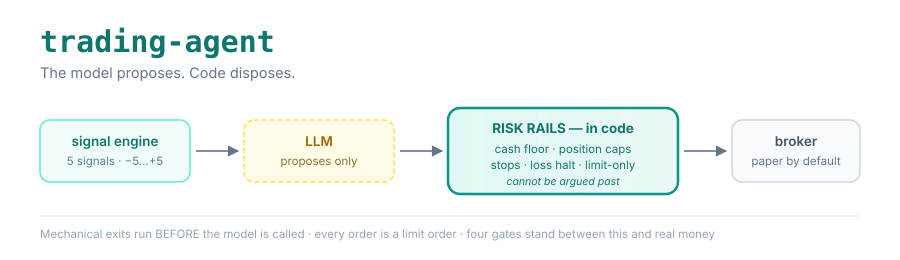
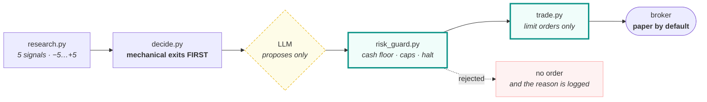

<p align="center">
  
</p>

<div align="center" style="line-height: 1;">
  <a href="#quick-start"></a>
  <a href="#the-rails"></a>
  <a href="#tests-as-a-design-tool"></a>
  <a href="LICENSE"></a>
  <a href="#not-advice"></a>
</div>

<br>

<div align="center">

🚀 [Getting Started](GETTING_STARTED.md) | 🚦 [The Rails](#the-rails) | 📈 [Signal Engine](#the-signal-engine) | 🧪 [Evidence](#evidence--what-we-tested-and-rejected) | ⚡ [Quick Start](#quick-start) | 🔬 [Tests as Design](#tests-as-a-design-tool) | 📓 [Engineering Notes](docs/ENGINEERING.md)

</div>

---

# trading-agent: risk rails first, model second

A rules-based, LLM-assisted trading agent for US equities and ETFs. It scores a
watchlist on five technical signals each morning, runs mechanical exits **before**
the model is ever called, lets an LLM propose trades within a bounded set, and
then enforces every risk rule in code that the model cannot reach.

The design premise is the inverse of most LLM trading projects: **the language
model is the least trusted component in the system.** It is given a narrow job —
choose among candidates that already passed the gates — and everything that could
lose money is decided elsewhere, in Python, under test.

> ### Not advice
> This is an engineering reference, not a strategy that is known to work. The
> thresholds in [`CLAUDE.md`](CLAUDE.md) were fitted to one 198-name universe over
> 2021–2026 and are published so you can see the reasoning, not so you can run
> them. Markets change; fitted parameters do not. Automated trading can lose money
> faster than manual trading, including while you are asleep. See
> **[DISCLAIMER.md](DISCLAIMER.md)** and [LICENSE](LICENSE) — there is no warranty
> of any kind.

## Provenance

Extracted from a private system that has traded a paper book unattended since
2025, and a small live book since mid-2026. What ships here is the engine and the
discipline around it. What does not ship: the account, its history, the
deployment infrastructure, and every fitted artifact that describes a universe
that is not yours.

Roughly a dozen of the practices below exist because something broke first. Where
that is true, the code says so in a comment — those comments are the most useful
documentation in the repository.

---

## The Rails

Everything in this section is enforced in Python, after the model has spoken, and
none of it is reachable from a prompt.



Read the order carefully: **exits run before the model is called.** A stop-loss or
profit-take never waits on an LLM being available, in-budget, or agreeable — by the
time the model sees the book, those decisions are already executed facts.

### Four gates before real money

The wizard's live path (`python3 setup_wizard.py --live`) is deliberately harder
than its paper path: it refuses without recorded paper sessions, asks whether you
have read the three files that gate a bad order, makes you name an amount you'd be
untroubled to lose, and makes you type a sentence rather than press Enter.

`accounts.is_live()` returns `False` — meaning paper — unless **all four** hold:

```bash
I_UNDERSTAND_THIS_TRADES_REAL_MONEY=yes   # explicit acknowledgement
LIVE_TRADING=true                          # global master switch
LIVE_ACCOUNTS=core                         # per-account opt-in
ALPACA_LIVE_API_KEY / _SECRET_KEY          # separate live credentials
```

Three came from upstream. The acknowledgement gate is specific to this public
release: a copied `.env` should never be one variable away from real orders.

### One rule, one owner

The −8% stop and the trailing ladder were once defined in three files, and they
drifted. Now `stops.py` owns the rule, every consumer imports it, and
`tests/test_stop_rule.py` fails if a second definition appears anywhere.

| Rule | Owner | Tripwire |
|---|---|---|
| Hard stop, trailing ladder, take-profit | `stops.py` | `test_stop_rule.py` |
| Position cap per symbol | `accounts.effective_max_allocation()` | `test_allocation_rule.py` |
| Cash floor, order caps, daily-loss halt | `risk_guard.py` | `test_safety.py` |
| Every order is a limit order | `trade.py` | `test_safety.py` |

### Stops for positions no broker will hold

Brokers reject stop orders on fractional shares. On a small account nearly every
position is fractional, which means the entire book can round-trip a gain with
only the hard floor beneath it. `stop_monitor.py` enforces the same ratchet
in-process every five minutes and persists the high-water mark, so a sub-share
position is protected by the file rather than by nothing.

### Reconciliation that detects drift, not absence

Checking "is the symbol still there" passes happily through a split, an
assignment, or an exit that sold half of what it claimed. `ledger.reconcile()`
snapshot-diffs quantity and cost basis, fingerprints splits by clean ratio, and
tolerates DRIP dust so the alarm stays worth reading.

---

## The Signal Engine

`research.py` needs **no LLM key**. Run it standalone to see exactly what the
model would be shown.

Five independent signals, each −1/0/+1, summed to a composite −5…+5:

| Indicator | Bullish +1 | Bearish −1 |
|---|---|---|
| RSI(14) | < 30 oversold | > 70 overbought |
| SMA 50/200 | golden cross | death cross |
| MACD(12,26,9) | line above signal | line below signal |
| Bollinger %B(20) | < 0.10 near lower band | > 0.90 near upper band |
| Volume | > 1.5× 20-day avg | < 0.8× avg |

A second `weighted_score` applies empirically-derived weights. Bearish signals are
deliberately down-weighted: in the tested universe they still preceded next-day
*gains* about 60% of the time, because the market's upward drift swamps a weak
bearish read.

### Three entry archetypes

| Archetype | Buys | Loads on |
|---|---|---|
| **Dip** | weakness at support, ML-gated | short-term reversion |
| **Breakout** | strength on expanding volume | trend |
| **Momentum** | 12-1 return, top decile | slow trend |

`CLAUDE.md` documents which of these carried the tested book and which did not.

### Inputs that are not price

Every signal above is a transform of OHLCV, and a model fitted on that feature set
topped out near 0.50 AUC — the measured way of saying the well is dry. These carry
information price does not:

- **`insider_flow.py`** — SEC Form 4 open-market cluster buys. Legally compelled
  disclosure of what insiders did with their own money. Buying is predictive;
  selling largely is not, and the code counts them separately rather than netting.
- **`prediction_markets.py`** — Polymarket probabilities on Fed moves, inflation
  and geopolitics. Forward-looking, keyless, no LLM. Selected by topic tag rather
  than volume, because the highest-volume markets on the platform are novelty bets.
- **`iv_metrics.py`** — where implied vol sits in its own trailing range.
- **`earnings_calendar.py`** — the blackout is enforced in code, not requested.

---

## Evidence — what we tested and rejected

Most trading repos publish what worked. This one also publishes what did not,
because a rejected strategy is the more durable artifact — it stops the next
person re-deriving it.

Four payoff sources were built on the same 198-name universe, 2021-05 → 2026-06,
net of 5bp costs:

| Bet | Sharpe gross → net | Verdict |
|---|---|---|
| Trend (breakout, 12-1 momentum) | — | **Kept** — carried the book |
| Carry (variance risk premium) | — | **Kept** (sleeve not shipped here) |
| Short-term reversion, 5-day | +0.09 → **−0.35** | **Rejected** |
| Liquidity provision, volume-shock | +0.01 → **−0.28** | **Rejected** |

Both rejected bets were roughly break-even *gross*. At 162× and 123× annual
turnover, 5bp per side consumes the entire edge. They are real premia in the
literature and simply not harvestable at this cost base and holding period.

**A strategy that must trade every day is a strategy you cannot afford.**

### Measuring against a benchmark, not zero

`memory_v2.py` scores every trade at T+5 as **excess return over SPY across the
same holding period**. Scoring against zero counts market drift as skill: in a
week the index rose 4%, most randomly chosen stocks are up. Applying this one
correction upstream turned a reported "100% win rate" into "0% beat-market."

---

## Quick Start

**No coding required — a guided wizard asks you questions and verifies each answer:**

```bash
git clone https://github.com/fail-closed/trading-agent-oss.git && cd trading-agent-oss
python3 setup_wizard.py
```

It checks your Python, installs everything into an isolated folder, takes your
Alpaca **paper** keys and verifies them against the real broker, lets you pick a
watchlist, and runs the engine once so you see real output. Nothing is written
until your details are confirmed working; Ctrl-C backs out cleanly.

Full walkthrough: **[GETTING_STARTED.md](GETTING_STARTED.md)**.

<details>
<summary>Manual setup, if you'd rather</summary>

```bash
python3 -m venv .venv && source .venv/bin/activate
pip install -r requirements.txt
cp .env.example .env          # add Alpaca PAPER keys — free, no funding required
```
</details>

```bash
python research.py            # no LLM key needed — prints today's signals
pytest -q                     # 262 tests
```

**Edit `watchlist.json` before anything else.** The ten symbols shipped are liquid
large caps chosen so a first run works. They are not a recommendation.

### A session

```
09:45  research.py    bars → signals → signals/<date>.json
10:00  decide.py      mechanical exits FIRST, then the model proposes,
                      then risk_guard + trade.py enforce
16:15  journal.py     write the day, score matured trades, update memory
```

Wire these to cron, a scheduler, or run them by hand. Deployment is deliberately
not shipped.

### Required and optional keys

| Key | Needed for | Free? |
|---|---|---|
| `ALPACA_API_KEY` / `_SECRET_KEY` | everything | yes, paper needs no funding |
| `ANTHROPIC_API_KEY` | `decide.py`, `macro_context.py` only | no |
| `FRED_API_KEY` | macro regime | yes |
| — | `prediction_markets.py` | keyless |

---

## Tests as a design tool

262 tests, and the interesting ones do not check behaviour — they make a class of
mistake impossible.

| Tripwire | Prevents |
|---|---|
| `test_coverage_floor.py` | A module with real logic shipping untested. Every module is tested **or** listed with a written reason |
| `test_state_registry.py` | State whose loss nobody considered. Every state file is backed up **or** declared disposable with a reason |
| both of the above | Scope creep in the *tripwire itself* — they walk packages, not just the repo root, so moving code into a package can't silently drop it out of CI's view |
| `test_stop_rule.py` | A second definition of the stop appearing anywhere |
| `test_allocation_rule.py` | A position cap computed inline instead of via the shared helper |

The rule they encode is easy to state and hard to keep: **you may decide anything,
but you may not fail to decide.**

> **Verify the verifier.** A passing check and an absent check look identical from
> outside — both report success. Every tripwire here was validated by breaking it
> on purpose and watching it fail; the probe is named in the docstring. This is not
> hypothetical: `test_state_registry` shipped with a detector that matched only
> bare string literals, so six state files — including one tracking spend against a
> paid API budget — were invisible to a test whose entire purpose was seeing them.

More in [docs/ENGINEERING.md](docs/ENGINEERING.md).

---

## What is deliberately not here

| Omitted | Why |
|---|---|
| Options and covered-call sleeves | The only premium-**selling** path. An options writer in a starter repo invites the accident the rails exist to prevent |
| Day-trade / mean-reversion sleeves | Ran virtual-only upstream; no validated edge to pass on |
| Scheduler, dashboard, alerting, DB mirror | Deployment-specific |
| Backtests and the fitted ML model | Fitted to a universe that is not yours. `ml_trainer.py` ships so you can train your own |
| All journals, signals and trading history | Someone's actual book |

Seven modules sit in `NO_TESTS` with written reasons — their upstream tests depend
on infrastructure not shipped here. That list is honest rather than empty by
design, which is the same principle as everything above.

## Contributing

Issues and PRs welcome. Two asks, both drawn from the notes above:

1. **Name the test** that would fail if your change broke. New behaviour ships
   with it, or with a written reason in `NO_TESTS`.
2. **If you touch a tripwire, say how you broke it and saw it fail.**

## License

[MIT](LICENSE) — verbatim, so it is machine-detectable.

The financial-software caveats live in **[DISCLAIMER.md](DISCLAIMER.md)**, kept
separate on purpose: appending them to `LICENSE` made GitHub classify the whole
file as `NOASSERTION`, which helps nobody. Read it before running this against
real money. No warranty; you are responsible for orders placed by software you
run, whether or not you were awake.
